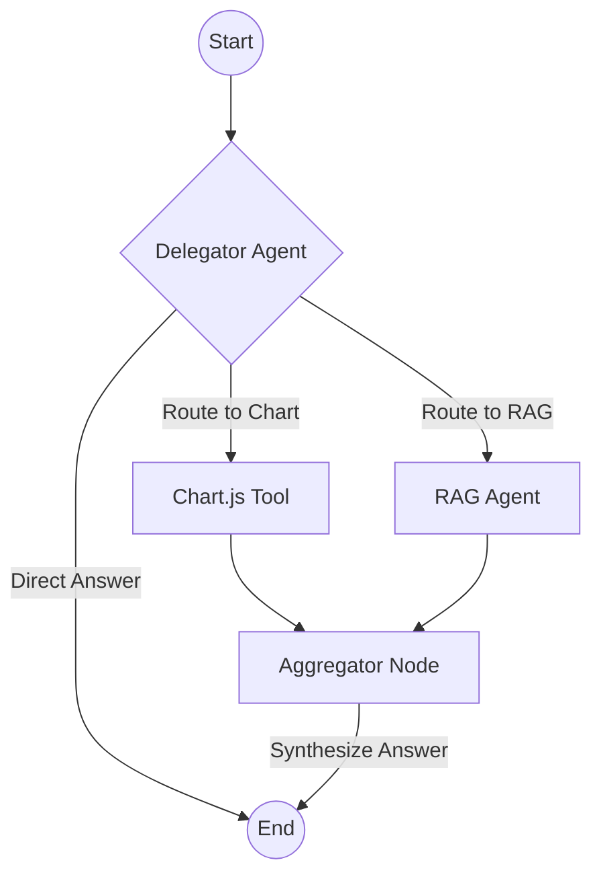

# LLM Agent Assessment - Hierarchical Agent System

This project implements a hierarchical LLM agent system using LangGraph, Weaviate, and Google's Gemini API.

## Features
- **Delegating Agent**: Orchestrates routing decisions based on user queries using Gemini.
- **RAG Agent**: Retrieves information from a multi-tenant Weaviate vector database with reference formatting.
- **Chart.js Tool**: Generates Chart.js configurations for data visualization.
- **Parallel Execution**: Executes RAG and Chart tools in parallel when needed.
- **Streaming**: Streams agent progress and returns final structured data.
- **Industrial Standards**: Fully typed (TypeScript), documented (TSDoc), and hardened for production.

## System Architecture



## Project Structure
- `src/agents`: Delegating and RAG agent implementations.
- `src/tools`: Chart.js mock tool.
- `src/database`: Weaviate client and schema/seeding scripts.
- `src/config`: LLM configuration (Gemini).
- `src/types`: TypeScript interfaces.

## Setup

### 1. Prerequisites
- Docker & Docker Compose
- Node.js 18+
- Google Gemini API Key: Gemini 2.5 Flash is used for the LLM, and `gemini-embedding-001` for vectors. ([Get one for free](https://makersuite.google.com/app/apikey))

### 2. Install Dependencies
```bash
npm install
```

### 3. Environment Variables
Create a `.env` file based on `.env.example`:
```bash
GOOGLE_API_KEY=your_gemini_api_key_here
WEAVIATE_URL=http://localhost:8080
```

**Important:** Replace `your_gemini_api_key_here` with your actual Gemini API key from [Google AI Studio](https://makersuite.google.com/app/apikey).

### 4. Start Weaviate
```bash
docker-compose up -d
```

### 5. Setup Database and Run
```bash
# Setup schema and seed data
npx ts-node src/index.ts --setup-db

# Run the system
npx ts-node src/index.ts
```

## Features Deep Dive

### Generalized Direct Answers
The system intelligently detects if a query can be answered using internal model knowledge (like greetings or general facts) without querying RAG or generating charts, significantly reducing latency and token costs.

## Test Cases
The system is verified with the following scenarios:
1. **Chart Only**: "Create a bar chart showing quarterly revenue..."
2. **RAG Only**: "What are the system requirements...?"
3. **Both Tools**: "Show me a chart... and explain the growth drivers"
4. **Direct Answer (Math)**: "What is 25 + 37?"
5. **Direct Answer (Fact)**: "What is the capital of France?"
6. **Direct Answer (Greeting)**: "Hello! How are you today?"

## Reference Formatting
RAG responses include references formatted as `[File X - Page Y, Z]`. The final response payload contains a detailed `data` array with all retrieved references and generated chart configs.
