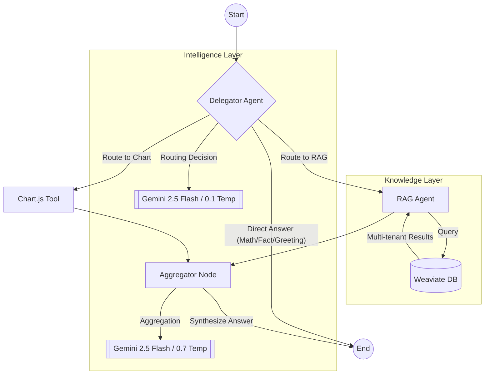

# LLM Agent Assessment - Hierarchical Agent System

A production-grade, hierarchical multi-agent system built with **LangGraph**, **Weaviate**, and **Google Gemini 2.5**. This system intelligently orchestrates specialized agents to handle RAG-based queries, data visualization, and direct conversational interactions with industrial-grade resilience and observability.

## 🚀 Key Features

- **Hierarchical Orchestration**: Uses LangGraph to manage complex state transitions between a Delegator and specialized workers.
- **Intelligent Routing**: 
  - **Tier 1 (High-Precision)**: Gemini 2.5 Flash analyzes query intent to route to Chart, RAG, or Direct Answer.
  - **Tier 2 (Resilient Fallback)**: Robust keyword-based routing ensures functionality even during API outages or quota limits.
- **Multi-Tenant RAG**: Secure document retrieval from a multi-tenant Weaviate collection with automated reference formatting.
- **Dynamic Visualization**: Generates realistic Chart.js configurations from natural language descriptions.
- **Developer Excellence**: 
  - 100% TypeScript with strict typing.
  - Comprehensive TSDoc/JSDoc documentation.
  - Performance monitoring with integrated latency markers.
  - Resilient infrastructure with health-check retry loops.

## 🏗️ System Architecture

The following diagram illustrates the hierarchical orchestration tree:



### Core Components

1.  **Delegator Node**: The "Brain" of the system. It classifies the query and decides which worker nodes to activate. It uses a low-temperature Gemini instance for deterministic routing.
2.  **RAG Agent**: A specialized worker that generates embeddings, queries Weaviate with tenant isolation, and formats references into standard citing format: `[File X - Page Y]`.
3.  **Chart Tool**: A mock tool that maps natural language intents to data structures for Chart.js.
4.  **Aggregator Node**: Synthesizes inputs from multiple workers into a final, coherent response using a higher-temperature Gemini instance for natural conversation.

## 🛠️ Setup & Installation

### 1. Prerequisites
- Docker & Docker Compose
- Node.js 18+
- Google Gemini API Key ([Get one for free](https://makersuite.google.com/app/apikey))

### 2. Configuration
Create a `.env` file:
```bash
GOOGLE_API_KEY=your_gemini_api_key_here
WEAVIATE_URL=http://localhost:8080
NODE_ENV=development
```

### 3. Execution
```bash
# Start infrastructure
docker-compose up -d

# Install and build
npm install

# Setup database (Schema & Seeding)
npx ts-node src/index.ts --setup-db

# Run full test suite
npx ts-node src/index.ts
```

## 🛡️ Resilience & Reliability

The system is designed with a "Fail-Soft" philosophy:
- **Connection Hardening**: The setup script implements a health-check loop that waits for Weaviate to be fully responsive before attempting schema operations.
- **Routing Fallback**: If the Gemini API hits a quota limit or fails, the Delegator automatically switches to a regex-based keyword router to maintain core functionality.
- **Node-Level Safety**: Each LangGraph node is wrapped in try-catch blocks to ensure that a failure in one worker (e.g., RAG) doesn't crash the entire flow.

## 📊 Observability
Every query execution prints a performance summary:
- **Latency**: Total end-to-end execution time.
- **Trace**: [LLM Routing] vs [Keyword Fallback] markers.
- **Payload**: Structured JSON output of all underlying data (Chart configs, RAG metadata).

## 📂 Project Structure
- `src/agents`: Intelligent worker logic (LangGraph nodes).
- `src/tools`: Specialized function tools (Chart.js).
- `src/database`: Multi-tenant Weaviate integration.
- `src/config`: Centralized Gemini & Environment management.
- `src/types`: Strict TypeScript definitions.

---
*Built for excellence with LangGraph and Gemini 2.5.*
